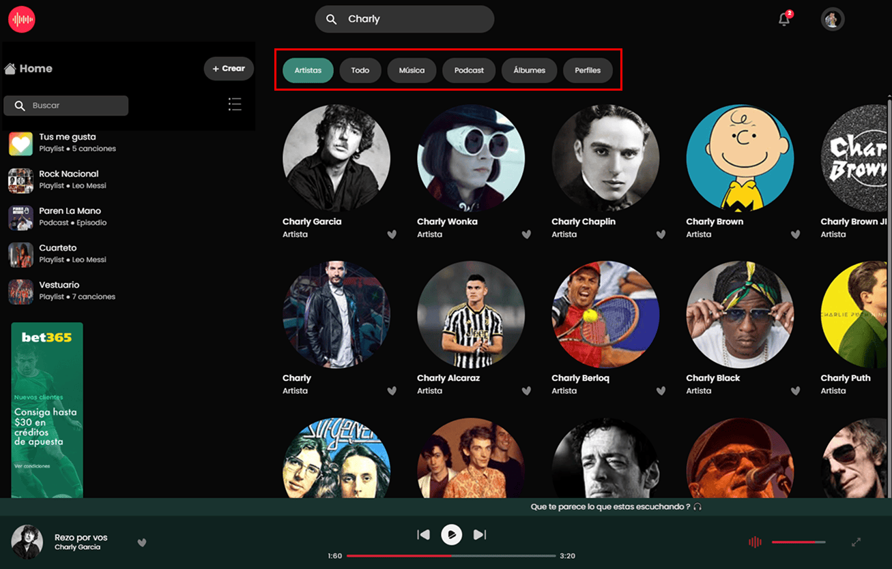

# Final Interfaces de usuario e Interacción
## Plataforma de música online

## Spoiler Five Inc.
“Spoiler Five Inc.” es una aplicación multiplataforma argentina, empleada para la reproducción de música vía streaming. Cuenta con un modelo de negocio «premium», un servicio gratuito básico y con publicidad; pero con características adicionales, con una mejor calidad de audio, a través de una suscripción de pago.

## ℹ️ Aclaración  
Las siguientes características están optimizadas para dispositivos con una resolución de **1200px o superior**.

## Características
Se deberá diseñar la interfaz de un sitio web que soporte las siguientes características:

## 1. **Buscar Música o Podcasts o lo que sea (audios)**  
   
     

## 2. **Filtrar los audios por diferentes criterios**  

     

## 3. **Buscar, Crear, eliminar, modificar y escuchar playlists**  

   - **Buscar y Crear**  
     
       

   - **Escuchar y Opciones**  
     
       

   - **Eliminar y Modificar**  
     
       

## 4. **Suscribirse a un plan mensual (existen 4 planes)**  

## 5. **Iniciar sesión y configurar “mi cuenta”, preferencias, etc**  

   - **Botón en el nav para iniciar sesión**  
     
       

   - **Acceso a "Mi Cuenta"**  
     
       

   - **Configuración de imagen de perfil y de la portada**  
     
       

   - **Configuración de cuenta (suscripción, miembros, plan)**  
     
       

## 6. **Escuchar con un player, que la música o el audio no pare mientras navego y busco otro tema, y debería siempre poder pausar la música o subir el volumen, etc. La música o el audio no se detiene mientras el usuario navega. Permite pausar, cambiar el volumen, etc.**  

   - **Reproductor con posición fija disponible en todo momento**  
     
       

## 7. **Ver el resumen de una banda, autor, episodio de podcast, etc**  

## 8. **Calificar un audio y/o playlist**  

## 9. **Ver las calificaciones y opiniones de un determinado audio**  

## 10. **Se debe incluir una página de soporte, faq, ayuda o similar**  

   - **Página de Preguntas Frecuentes (FAQ)**  
     
       

## 11. **Ver sugerencias personalizadas**  
   Recomendaciones basadas en los gustos del usuario.  

   - **Ejemplo: Carrusel de música relacionada con el Rock Nacional**  
     
       

## 12. **Ver recomendaciones destacadas**  
   Listas de reproducción sugerida en base a la reproducción del usuario.  

   - **Carrusel con música similar a la que escucha el usuario**  
     
       

## 13. **Recibir y ver notificaciones personalizadas**   

   - **En la primera imagen**, vemos el icono de **notificacion** con un circulo rojo, indicando 2 nuevas notificaciones.  
   - **En la segunda imagen**, se muestra el modal abierto con las notificaciones recibidas. Entre ellas: **me gustas en playlist** y **notificaciones personalizadas** .

       

## 14. **Guardar audios, podcasts, o playlists favoritos**  

   - **Ejemplo 1: Guardar audios desde un carrusel**  
     
       

   - **Ejemplo 2: Guardar audios desde una card grande**  
     
       

## 15. **Compartir mi playlist y ver cuantas reproducciones tuvo esa playlist**  

   - **En la primera imagen**, se muestra un botón para compartir la playlist junto con la cantidad de reproducciones.  
   - **En la segunda imagen**, se muestra el modal abierto con las opciones de redes para compartir la playlist y el enlace para copiar.  

     
   
    
## 16. **Se debe incentivar al usuario a calificar y opinar acerca de la playlist o tema o podcast que está escuchando**  

## Consideraciones del equipo de análisis
- Los usuarios valoran mucho las **sugerencias personalizadas** y la **facilidad en las búsquedas**.
- Los **filtros complejos no se utilizan**; se recomienda un sistema de filtrado más sencillo.
- La mayoría de los usuarios escucha música según **su ubicación o actividad** (trabajo, colectivo, ejercicio, etc.).
- Los usuarios siempre quieren escuchar **lo último disponible**.

## Presentar los diseños y maquetas para las siguientes páginas/características:
1. **Homepage**: Categorías, recomendaciones, etc. (incluyendo el modo reproducción).
2. **Búsquedas generales**.
3. **Filtrado**.
4. **Página de suscripción o planes**.
5. **Página de “Mi cuenta”**.

### Opcionales
6. **Calificación de un tema o playlist**.

7. **Ficha de un tema, podcast o playlist**.

   - **Ficha Playlist**, se muestra detalle de la playlist con su **imagen, nombre, creador, cantidad de canciones, cantidad de reproducciones**.
   -  Ademas se encuentran los botones de **play**, **detalles**, **guardar como favorito** y **compartir**,

     

8. **Marcar un tema o playlist como favorita**.

## Entrega
La entrega se deberá realizar utilizando el branch `gh-pages` de GitHub, con una página `index.html` que contenga links a:
- **Prototipos en papel** (opcionales).
- **Prototipos en alta fidelidad** (modo EDITOR y modo PRESENTACIÓN en Figma).
- **Prototipo funcional** implementado con HTML, CSS y JS. (Indicar si se usa un framework).

**Tiempo de entrega: 25 días.**
